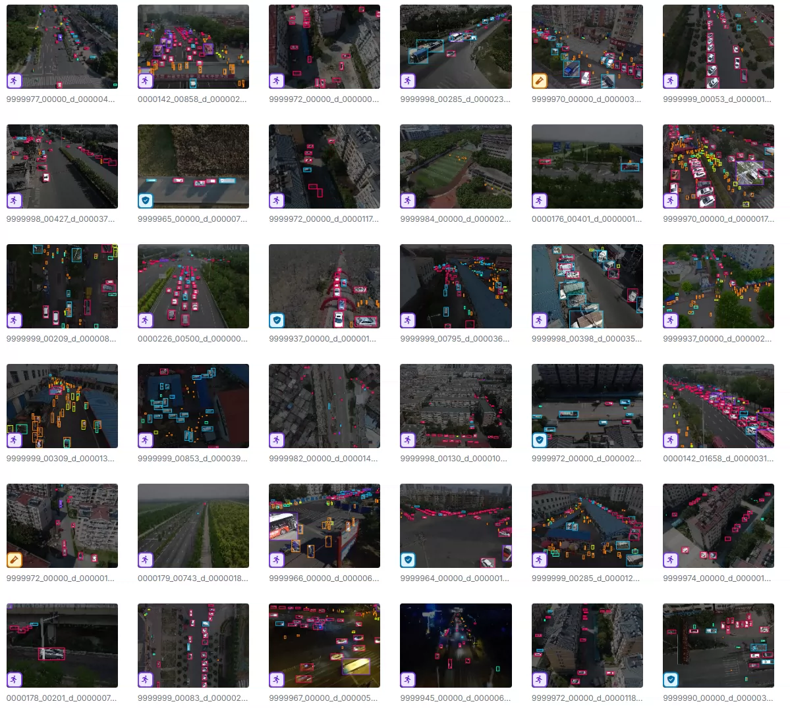
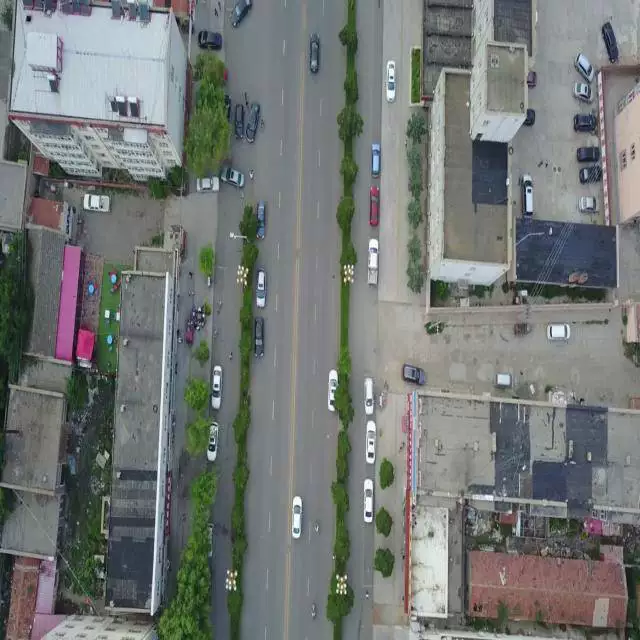
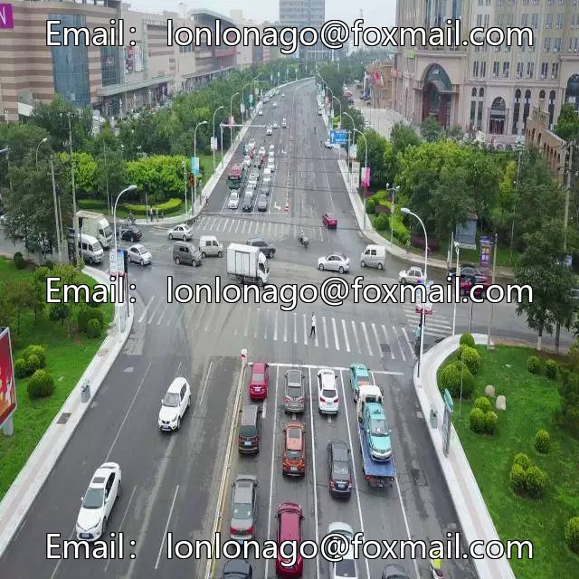
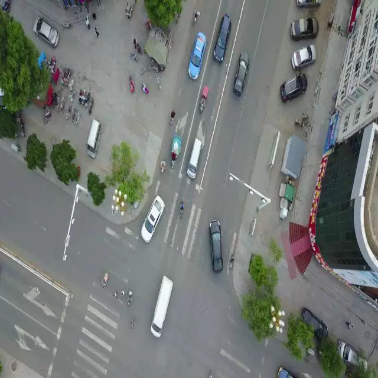

## Body

Empty Ground Object Detection and UAV Airborne Target Identification

Totally 3000 images, each labeled separately.
Divided into 6 categories, namely 'bicycle', 'bus', 'car', 'motorcycle', 'person', 'truck'
"Bicycle", "Public Bus", "Car", "Motorcycle", "Person", "Truck"

## Images

Here is a pay link on Stripe ( https://buy.stripe.com/3cs8yP7sY87d0vu9AB ). Please contact me lonlonago@foxmail.com after funding $89, and I will send you a complete data files , thank you!

